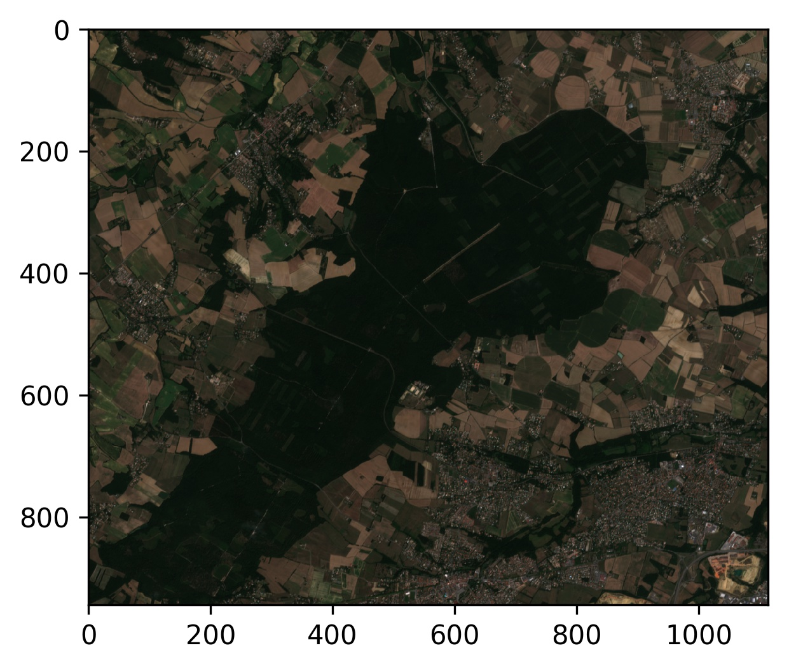
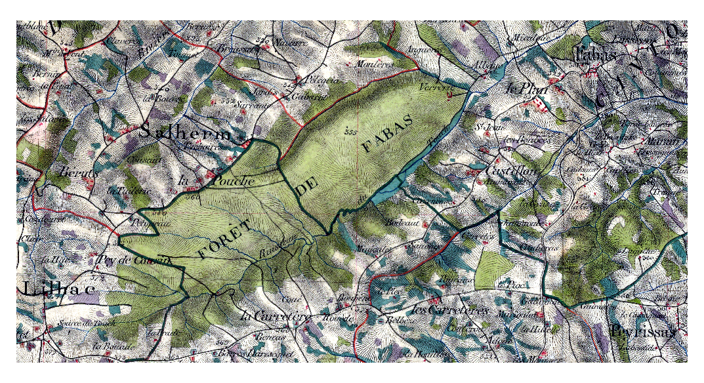
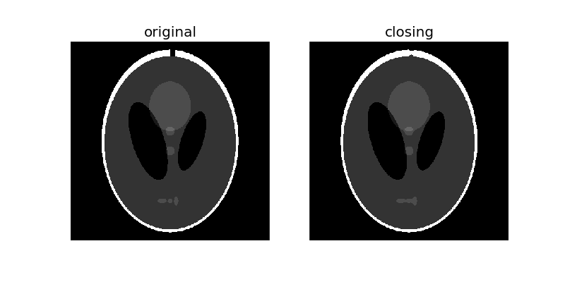
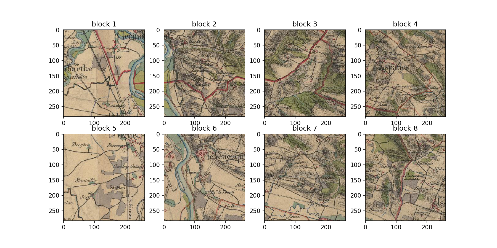

# Cours de télédétection avancée pour Master Sigma.
<!-- to generate toc type "~/gh-md-toc --insert README.md" -->

<!--ts-->
   * [Cours de télédétection avancée pour Master Sigma.](#cours-de-télédétection-avancée-pour-master-sigma)
   * [Introduction](#introduction)
      * [Objectif](#objectif)
      * [Les bibliothèques python utilisées](#les-bibliothèques-python-utilisées)
      * [Le respect des conventions](#le-respect-des-conventions)
      * [Planning](#planning)
   * [Gestion des tableaux](#gestion-des-tableaux)
      * [Principe de numpy](#principe-de-numpy)
         * [Ouvrir et connaître les informations principales](#ouvrir-et-connaître-les-informations-principales)
            * [Exercice](#exercice)
         * [Parcourir et afficher un tableau](#parcourir-et-afficher-un-tableau)
            * [Exercice](#exercice-1)
   * [D'une image au tableau](#dune-image-au-tableau)
      * [Lecture et ouverture d'une image](#lecture-et-ouverture-dune-image)
         * [Exercice](#exercice-2)
   * [Écriture d'une image géoréférencée](#écriture-dune-image-géoréférencée)
      * [Exercice](#exercice-3)
   * [Filtre spatial (tenant compte des voisins)](#filtre-spatial-tenant-compte-des-voisins)
      * [Exercice](#exercice-4)
   * [Museo ToolBox](#museo-toolbox)
      * [Installation de Museo ToolBox](#installation-de-museo-toolbox)
      * [Comment fonctionne RasterMath ?](#comment-fonctionne-rastermath-)
      * [Premiers pas avec Museo ToolBox et RasterMath](#premiers-pas-avec-museo-toolbox-et-rastermath)
      * [Création d'une fonction pour calculer le NDVI](#création-dune-fonction-pour-calculer-le-ndvi)
   * [Apprentissage automatique sans images](#apprentissage-automatique-sans-images)
      * [Installer scikit-learn](#installer-scikit-learn)
      * [Premiers pas avec scikit-learn](#premiers-pas-avec-scikit-learn)
      * [Valider un modèle](#valider-un-modèle)
         * [Garder des échantillons de côté](#garder-des-échantillons-de-côté)
         * [Estimer la qualité du modèle](#estimer-la-qualité-du-modèle)
      * [Questions](#questions)
   * [Apprentissage automatique à partir d'images](#apprentissage-automatique-à-partir-dimages)
   * [TO FINISH](#to-finish)

<!-- Added by: nicolas, at: lundi 16 décembre 2019, 12:37:59 (UTC+0100) -->

<!--te-->

# Introduction

## Objectif

Ce cours a pour but de vous rendre le plus autonome possible en télédétection à partir de python. À la fin de ce cours vous serez capable d'interagir avec des images directement depuis python et ce de manière optimisée et efficiente (lecture par bloc par exemple). Vous allez aussi découvrir comment manier les algorithmes d'apprentissage automatique afin d'apprendre des modèles pour cartographier par l'exemple l'occupation du sol.

Les [données utilisées pour ce cours sont disponibles ici en ligne](https://github.com/nkarasiak/rs_advanced_sigma/archive/data.zip).

## Les bibliothèques python utilisées

Les bibliothèques python utilisées dans ce cours sont :
- gdal (raster)
- osr (projection)
- ogr (vecteur)
- numpy (tableau)
- scipy (calcul scientifique)
- scikit-learn (apprentissage automatique)
- museotoolbox (facilite la lecture/écriture des rasters)

Si une des bibliothèques venait à manquer, vous pouvez l'installer en tapant la commande suivante dans le terminal :
```bash
python3 -m pip install scikit-learn --user
```
## Le respect des conventions

Toutes les classes, fonctions et variables que nous allons créer pendant ce cours doivent suivre le [convention PEP8](https://realpython.com/python-pep8/).

| Type | Écriture |
|------|----------|
| Class | `MaSuperClasse` |
| Function | `ma_super_fonction` |
| Variable | `ma_variable` |

Les codes doivent être bien documentés, en suivant la [docstring numpy](https://sphinxcontrib-napoleon.readthedocs.io/en/latest/example_numpy.html).

/!\ [Attention, un canard en plastique pourra venir relire et valider votre code](https://fr.wikipedia.org/wiki/M%C3%A9thode_du_canard_en_plastique).

## Planning

| Ordre | Date            | Horaire     | Thème                                                 |
|-------|-----------------|-------------|-------------------------------------------------------|
| 1     | Lun. 02/12/2019 | 8h/12h 	| Manipulation des tableaux/matrices.         		|
| 2     | Lun. 09/12/2019 | 8h/12h 	| Du tableau au raster. 				|
| 3     | Lun. 16/12/2019 | 13h30/17h30 | Filtre spatial (tenant compte des voisins)		|
| 4       | Ven. 18/12/2019 | 8h/12h      | Apprentissage automatique avec scikit-learn   	|
| 5     | Mer. 08/01/2020 | 8h/12h	| Découverte de Museo ToolBox                           |
| 6     | Ven. 08/01/2020 | 13h30/17h30 | PARTIEL                                               |

---

# Gestion des tableaux

Pour gérer un tableau ou une matrice (c'est-à-dire une image sans géoréférencement)

## Principe de numpy

### Ouvrir et connaître les informations principales

```python
import numpy as np
X = np.load('sentinel2_3a_20180815.npy')
X.shape # la taille de l'image (lignes, colonnes, bandes...)
>>> (200, 200, 4)
X.ndim # le nombre de dimensions
>>> 3
X.size # le nombre de cellules
>>> 160000
```

#### Exercice

- Comment pouvez-vous obtenir uniquement le nombre de lignes ?
- Comment pouvez-vous obtenir uniquement le nombre de bandes ?
- De combien de pixels est composée chaque bande ?

### Parcourir et afficher un tableau

Les `:` permettent de sélectionner toutes les cellules de la dimension en question.

Les `...` permettent de sélectionner toutes les dimensions suivantes ou précédentes.

```python
X[0,:,0] # première ligne, toutes les colonnes, première bande
X[0,...] # première ligne, et toutes les autres dimensions
X[...,0] # toutes les lignes et colonnes de la bande 0
```

```python
from matplotlib import pyplot as plt
plt.imshow((X[...,0])/(np.amax(X[...,0])),cmap='gray') # Si vous voulez afficher une bande
```

#### Exercice

- Accéder au pixel/ à la cellule de la première ligne et première colonne
- Accéder au pixel / à la cellule de la dernière ligne et dernière colonne
- Parcourir la matrice cellule par cellule (boucle for)
- Calculer le ndvi :


Sachant que l'infra-rouge est la dernière bande (la numéro 4, donc en partant de 0 la numéro 3, et le rouge est la bande numéro 3).

Pour ceux qui ont terminé, vous pouvez chronométrer et essayer d'optimiser le temps de traitement pour calculer le NDVI.

---

# D'une image au tableau



## Lecture et ouverture d'une image

```python
import gdal
data_src = gdal.Open('sentinel2_3a_20180815.tif') # objet gdal
data_src.RasterCount  # nombre de bandes
data_src.RasterXSize  # nombre de colonnes
data_src.RasterYSize  # nombre de lignes

data_src.GetRasterBand(1) # renvoie le tableau de la bande 1
data_src.GetRasterBand(2) # renvoie le tableau de la bande 2

data_src.ReadAsArray() # renvoie toute l'image en tableau
```

### Exercice

- De combien de bandes, de lignes, et de colonnes est composée l'image ?
- Ouvrir l'image en objet gdal
- Calculer le NDVI pour toute l'image.
- Optimiser le calcul du NDVI pour ne plus le faire cellule par cellule (éviter la boucle for).

---

# Écriture d'une image géoréférencée

Maintenant que l'on sait ouvrir, lire, et faire un traitement sur une image, il ne reste plus qu'à sauvegarder le résultat dans une nouvelle image.

Pour cela quelques lignes pour définir nos besoins sont nécessaires :

```python
driver = gdal.GetDriverByName("GTiff") # on choisi de créer un GeoTIFF
out_data = driver.Create('/tmp/mon_ndvi.tif', data_src.RasterXSize, data_src.RasterYSize, 1, gdal.GDT_Float32) # 1 pour une bande
out_data.SetGeoTransform(data_src.GetGeoTransform()) # même géotransformation que l'image d'origine
out_data.SetProjection(data_src.GetProjection()) # même projection que l'image d'origine
```

La variable out_data est désormais une instance de votre fichier de sortie. Vous pouvez désormais intéragir avec cette instance et sauvegarder le résultat du ndvi dans votre nouvelle image :

```python
out_data.GetRasterBand(1).WriteArray(ndvi) # j'écris mon NDVI dans la bande 1
out_data.FlushCache() # écrit sur le disque
out_data = None # précaution, permet de bien spécifier que le fichier est fermé
```

## Exercice

Créer pour chacune consignes suivantes une fonction qui vous permet :
- de lire une image (fonction retournant l'objet gdal)
- de calculer le NDVI (à partir de l'objet gdal, on demande à l'utilisateur la position de la bande rouge et infrarouge)
- d'écrire une image (on donne un objet gdal, un tableau et le nom de fichier que l'on veut écrire)

Une fois terminée, vous pourrez à partir de 3 lignes :
- ouvrir une image
- calculer le ndvi (en donnant un tableau par bande à la fonction, afin de ne presque pas modifier votre fonction précédente)
- écrire le ndvi

---

# Filtre spatial (tenant compte des voisins)

Comment identifier les forêts des cartes de l'État-Major ?
Des traits plus ou moins fins et plus ou moins serrés représentent les pentes dans les cartes. Nous avons donc besoin de supprimer ces rayures afind d'avoir une couleur verte homogène pour identifier la forêt.


Pour cela plusieurs filtres doivent être utilisés :
- closing filter (filtre de fermeture)
- médian (récupérer les contours)

[La carte de l'État-major est à télécharger ici](https://github.com/lennepkade/HistoricalMap/archive/samples.zip).

## Exercice

- Quelle est la valeur des pixels blancs ?
- Quelle est la valeur des pixels noirs ?
- Que fait et à quoi sert le closing filter ?




Créer une fonction qui parcourt l'image selon un nombre de voisins défini (1 = les premiers voisins (8 donc), 2 = les voisins jusqu'à 2 pixels de distance (24)...)
Puis en tenant compte des voisins, appliquez :
- un filtre max
- un filtre min
- un filtre median dont on peut définir le nombre d'itération

---

# Museo ToolBox

L'idée derrière Museo ToolBox est de créer une bibliothèque python assez généraliste pour la télédétection. L'un des points les plus cruciaux et la lecture et l'écriture par bloc des images. Pour faciliter cette étape, la classe ``RasterMath`` a été développée afin que l'utilisateur n'ait pas à se soucier du traitement du raster (projection, nombre de bandes, lecture par bloc, compression de l'image, gestion des no-data et du type de données). L'utilisateur a juste besoin de créer une fonction qui traite un tableau numpy, et  ``RasterMath`` se charge de tout le reste.



## Installation de Museo ToolBox

```bash
python3 -m pip install museotoolbox --user
```


## Comment fonctionne RasterMath ?


`RasterMath` est un outil du module `processing` du `Museo ToolBox`. Cette classe permet d'interagir facilement avec une ou plusieurs images et d'appliquer une fonction de votre choix. La lecture et l'écriture se fera bloc par bloc (cf graphique ci-dessus), et les paramètres de création du raster seront optimisés (compression par défaut, tuilage de l'image, choix du type de données selon le type du tableau numpy...)


## Premiers pas avec Museo ToolBox et RasterMath

```python3
import museotoolbox as mtb
```
Puis créez une instance de ``RasterMath`` avec l'image Sentinel-2, et donner un bloc de l'image choisi aléatoirement.

```python3
my_image = mtb.processing.RasterMath('sentinel2_3a_20180815.tif')
X = my_image.get_random_block()
print(X.shape)
  (65536, 10)
```
``RasterMath`` permet d'interagir facilement avec votre image. Par défaut, cette classe vous renvoie un pixel par ligne (ici 65536), et en colonne chaque bande du raster (ici 10).

## Création d'une fonction pour calculer le NDVI

```python3
def ndvi(X,r,ir):
  return np.divide(X[...,ir]-X[...,r],X[...,ir]+X[...,r])
```

Ensuite tester votre fonction tout simplement avec le bloc que vous avez eu en échantillon.

```python3
ndvi(X,2,3)
```
Si tout se déroule comme prévu, vous pouvez désormais demander à RasterMath d'ajouter la fonction qui calcule le NDVI. Pour ajouter des arguments qu'utilise votre fonction, il suffit de les renseigner par leur nom (ici : `r=2,ir=3`).

```python3
my_image.add_function(ndvi,r=2,ir=3,out_image='/tmp/ndvi.tif')
```
Il est à noter que l'on peut donner autant de fonctions que l'on souhaite à ``RasterMath``.
Une fois que vos fonctions sont validées, il ne vous reste plus qu'à demander l'exécution du calcul.

```python3
my_image.run()
```

Maintenant lire et écrire sur une raster ne prend plus que 3 lignes, il vous suffit juste d'avoir une fonction qui traite un tableau 2d ou 3d, et le tour est joué !

---

# Apprentissage automatique sans images

Scikit-Learn est une bibliothèque python d'apprentissage automatique. Elle regroupe de nombreux pré-traitements et algorithmes.

## Installer scikit-learn

Pour installer et/ou mettre à jour scikit-learn (et joblib qui gère les calculs sur plusieurs cœurs), il vous suffit d'ajouter l'option ``-U``  à la fin du code :

```bash
python3 -m pip install scikit-learn joblib --user -U
```

## Premiers pas avec scikit-learn

Pour apprendre un modèle il faut deux éléments :
- X : un tableau qui contient pour chaque échantillon (un échantillon par ligne) les variables en colonnes
- y : le label de chaque échantillon (un label par ligne).

```python
from sklearn.datasets import load_iris
X,y = load_iris(return_X_y=True)
```

Une fois qu'on a notre jeu de données, il faut choisir un algorithme.

Scikit-learn propose de très nombreux algorithmes. Je vous en ai sélectionné 3 :

- [Decision Tree](https://scikit-learn.org/stable/modules/generated/sklearn.tree.DecisionTreeClassifier.html?highlight=decision%20tree#sklearn.tree.DecisionTreeClassifier)
- [Random-Forest](https://scikit-learn.org/stable/modules/generated/sklearn.ensemble.RandomForestClassifier.html)
- [Support Vector Machine (SVC)](https://scikit-learn.org/stable/modules/generated/sklearn.svm.SVC.html)


Prenons le cas de l'arbre de décision (Decision Tree) :

```python
from sklearn.tree import DecisionTreeClassifier
model = DecisionTreeClassifier()
model.fit(X,y) # on apprend le modèle avec nos échantillons
model.predict(X) # on prédit le modèle sur nos échantillons
```
## Valider un modèle

### Garder des échantillons de côté

Dans le cas précédent, nous avons entraîné un modèle avec l'ensemble de données à notre disposition, nous ne pouvons donc pas le valider.

Pour valider le modèle, nous devons mettre de côté quelques échantillons afin de voir si l'algorithme peut retrouver le label sans jamais les avoir vu.

```python3
from sklearn.model_selection import train_test_split

X_train, X_test, y_train, y_test = train_test_split(X, y, test_size=0.33, random_state=42)
```
En utilisant la fonction ``train_test_split``, nous gardons 33% des données pour valider notre modèle et ainsi estimer sa qualité, et 66% des données pour l’entraîner.

```python
from sklearn.tree import DecisionTreeClassifier
model = DecisionTreeClassifier()
model.fit(X_train,y_train) # on apprend le modèle avec nos échantillons
y_pred = model.predict(X_test) # on prédit le modèle sur nos échantillons
```
Le plus ``y_pred`` sera semblable au ``y_test``, le plus performant sera le modèle.

### Estimer la qualité du modèle

Tout d'abord on peut calculer la matrice de confusion pour regarder la qualité générale du modèle et voir où le modèle s'est trompé et où il a bien réussi.

```
from sklearn.metrics import confusion_matrix,accuracy_score,f1_score

confusion_matrix = confusion_matrix(y,y_pred)
```

Si vous avez oublié comment lire une matrice de confusion, [je vous conseille de lire la page wikipédia qui y est dédiée](https://fr.wikipedia.org/wiki/Matrice_de_confusion).

Accord global (ou Overall accuracy), il s'agit du total de la diagonale sur le total d'échantillons prédits:
```python3
oa = np.sum(np.diag(confusion_matrix))/np.sum(confusion_matrix)
```
On peut aussi calculer l'OA avec scikit-learn

```python3
oa = accuracy_score(y,y_pred)
```
Le F1 est le nombre de commissions et d'omissions par classe :

```python3
f1 = f1_score(y,y_pred)
```

## Questions

- Quelle est la qualité globale de votre modèle ? Calculer le f1 moyen et l'accord global
- Quelle classe a été la mieux prédite ?
- Quelle classe a été la moins bien prédite ?


# Apprentissage automatique à partir d'images

Pour extraire les données d'une image et le label d'un polygone, nous utilisons la fonction ``extract_ROI`` de ``Museo ToolBox``.
``in_field`` correspond à la colonne qui contient pour chaque point/polygone le label de la classe.


```
X,y = mtb.processing.extract_ROI('sentinel2_3a_20180815.tif','ROI.gpkg','class')
```
Nous pouvons demander autant de colonnes de type numérique que l'on souhaite à `extract_ROI`. Par exemple pour obtenir le groupe, il suffit de rajouter un argument :

```
X,y,g = mtb.processing.extract_ROI('sentinel2_3a_20180815.tif','ROI.gpkg','class','group')
```

Ensuite, vous pouvez appliquer la même méthode que vue précédemment, ou alors partir sur une validation croisée pour fixer les paramètres de l'algorithme.

# TO FINISH

---
